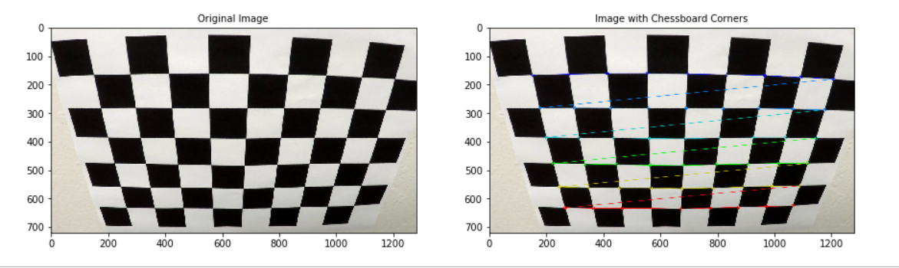
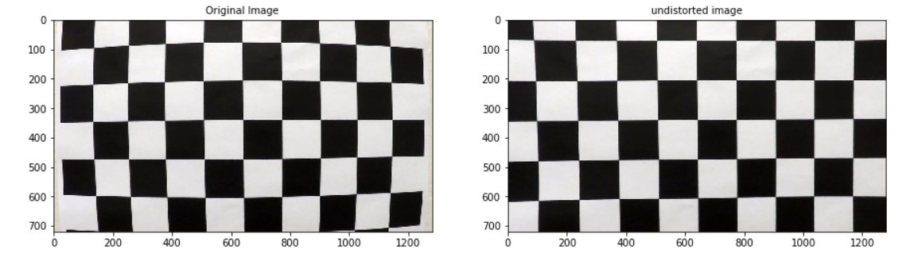
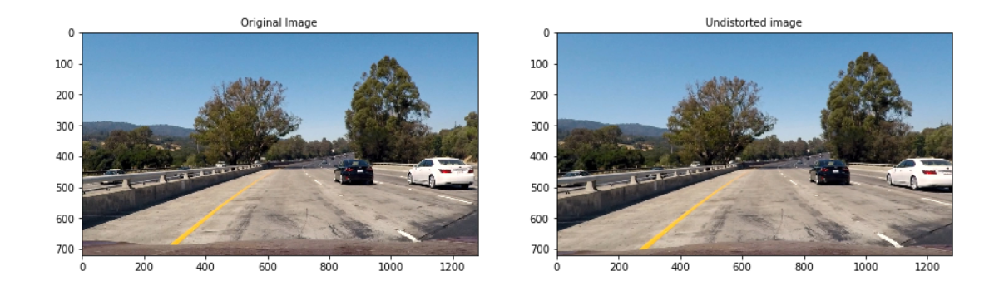
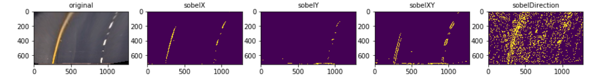

## Writeup Template

### You can use this file as a template for your writeup if you want to submit it as a markdown file, but feel free to use some other method and submit a pdf if you prefer.

---

**Advanced Lane Finding Project**

The goals / steps of this project are the following:

* Compute the camera calibration matrix and distortion coefficients given a set of chessboard images.

* Apply a distortion correction to raw images.
* Use color transforms, gradients, etc., to create a thresholded binary image.
* Apply a perspective transform to rectify binary image ("birds-eye view").
* Detect lane pixels and fit to find the lane boundary.
* Determine the curvature of the lane and vehicle position with respect to center.
* Warp the detected lane boundaries back onto the original image.
* Output visual display of the lane boundaries and numerical estimation of lane curvature and vehicle position.

[//]: # (Image References)

[image1]: ./examples/undistort_output.png "Undistorted"
[image2]: ./test_images/test1.jpg "Road Transformed"
[image3]: ./examples/binary_combo_example.jpg "Binary Example"
[image4]: ./examples/warped_straight_lines.jpg "Warp Example"
[image5]: ./examples/color_fit_lines.jpg "Fit Visual"
[image6]: ./examples/example_output.jpg "Output"
[video1]: ./project_video.mp4 "Video"

## [Rubric](https://review.udacity.com/#!/rubrics/571/view) Points

### Here I will consider the rubric points individually and describe how I addressed each point in my implementation.  

---

### Writeup / README

#### 1. Provide a Writeup / README that includes all the rubric points and how you addressed each one.  You can submit your writeup as markdown or pdf.  [Here](https://github.com/udacity/CarND-Advanced-Lane-Lines/blob/master/writeup_template.md) is a template writeup for this project you can use as a guide and a starting point.  

You're reading it!

### Camera Calibration

#### 1. Briefly state how you computed the camera matrix and distortion coefficients. Provide an example of a distortion corrected calibration image.

The code for this step is contained in the IPython notebook named 'AdvancedLineFinding.ipynb' in 1-5 cells. Images for camera caliberation is provided in the folder "./camera_cal/". I took this images and used  'ret, corners = cv2.findChessboardCorners(gray, (9,6), None)'. Here 9 and 6 are the numbers of chessboard lines. Thus I got image and object points in dicts named 'imgpoints' and 'objpoints'. Using this points, camera distortion matrices named 'mtx' and 'dist' are calculated with 'cv2.calibrateCamera' function.

Here is a sample image of chessboard image with found corners.

Undistorted image of chessboard is given below which is found using openCV funtion 'cv2.undistort' and 'mtx','dist' matrices.

Same method is applied for real captured images and a sample image is given below. The code can be found in 7th cell of IPython notebook. 

More examples can be found in IPython notebook.

### Perspective Transform

First I defined source and destination coordinates for region of interest for perspective transform, also called as birds eye view.
src=np.float32([[150,720], [590,450], [700,450], [1250,720]])
dst= np.float32([[200 ,720], [200  ,0], [980 ,0], [980 ,720]])

This resulted in the following source and destination points:

| Source        | Destination   | 
|:-------------:|:-------------:| 
| 150, 720      | 200, 720      | 
| 590, 450      | 200, 0        |
| 700, 450      | 980, 0        |
| 1250, 720     | 980, 720      |

This is found using trial and error method. The following Images shows what I did in this step. 

### Color Extraction and Sobel

Images can be splitted into different colorspaces. I also applied set a threshold of (100, 255) for better image feature extration. 
'cv2.cvtColor' fuction provides different colorspace properties. Sobel is another feature extraction which can be applied as gradient and directional. Code applied can be found in IPython notebook for further reference. Examples are given below.

color extraction

sobel application

I selected 'H' and 'L' color channels from 'HLS' colorspace and 'Y' from 'YUV' colorspace for better results.

### Find Line Pixels

Line pixels are found using sliding window algorithm. Using histogram, highest pixel values are found from binary images what we found using previous step.

Algorithm what I applied can be found in 'find_lane_pixels' function. X and Y coordinates of left and right lines are the outcome of this funtion.

### Fitting a polynomial

A polynomial function is calculated left and right line pixels using 'np.polyfit'. Here a quadilateral function is defined.

    left_fit = np.polyfit(lefty, leftx, 2)
    right_fit = np.polyfit(righty, rightx, 2)
 
    #Generate x and y values for plotting
    ploty = np.linspace(0, binary_warped.shape[0]-1, binary_warped.shape[0] )    
    
    #Calc both polynomials using ploty, left_fit and right_fit ###
    left_fitx = left_fit[0]*ploty**2 + left_fit[1]*ploty + left_fit[2]
    right_fitx = right_fit[0]*ploty**2 + right_fit[1]*ploty + right_fit[2]
    
complete code can be found in function 'fit_polynomial'

### Pipeline (video)

#### 1. Provide a link to your final video output.  Your pipeline should perform reasonably well on the entire project video (wobbly lines are ok but no catastrophic failures that would cause the car to drive off the road!).

Here's a [link to my video result](./project_video_output.mp4)

---

### Discussion

#### 1. Briefly discuss any problems / issues you faced in your implementation of this project.  Where will your pipeline likely fail?  What could you do to make it more robust?

1. Calculations for sliding window algorithm can be simplified
2. Calculations from a video contains continous frames. So calculations can also be simplified for this frames.
